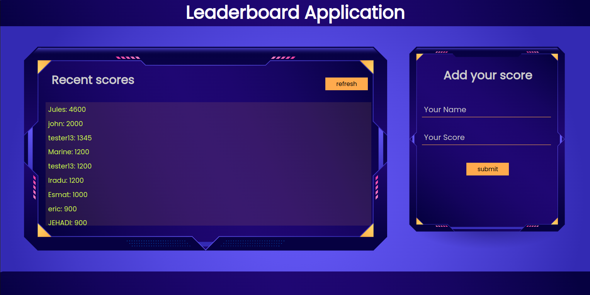

# Leaderboard

This is a JavaScript project for the Leaderboard list app, using webpack and ES6 features, notably modules. 

Project image

## Built With
- HTML
- CSS
- JS
## Live Demo

[Todo List](https://tuyishimireeric.github.io/Leaderboard/src/)

## Getting Started

To get a local copy up and running:

1. Clone this repository or download the zip folder:

**``git@github.com:TuyishimireEric/leaderboard.git``**

2. Navigate to the location of the folder in your machine:

**``you@your-Pc-name:~$ cd <folder>``**

To get a local copy up and running follow these simple example steps.

## Author

👤 **Eric Tuyishimire**

- GitHub: [@TuyishimireEric](https://github.com/TuyishimireEric)
- Twitter: [@Tuyishimire Eric](https://twitter.com/TuyishimireEric)
- E-mail: tuyishimireericc@gmail.com

## 🤝 Contributing

Contributions, issues, and feature requests are welcome!

Feel free to check the [issues page](https://github.com/TuyishimireEric/Leaderboard/issues).

## Show your support

Give a ⭐️ if you like this project!

## Acknowledgments

- Hat tip to anyone whose code was used
- Big thanks to the [Microverse](https://bit.ly/MicroverseTN) community with a special mention of my coding partners, morning session teams, standup teams and reviewers.

## 📝 License
This project is [MIT](./LICENSE.txt) licensed.